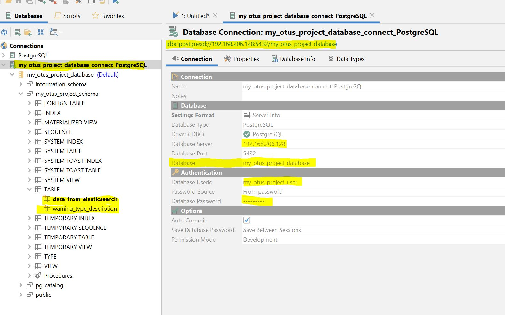
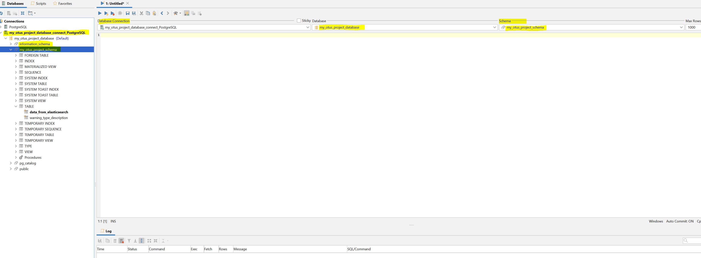

<h1 align="center"> ДЗ 4 </h1>
<h1 align="center"> DDL скрипты для postgreSQL </h1>

---
```sql
--Создал базу данных
CREATE DATABASE my_otus_project_database;

--Создал схему
CREATE SCHEMA my_otus_project_schema;

--Создал табличное пространство
CREATE TABLESPACE my_otus_project_tablespace LOCATION '/var/lib/postgresql/13/main/my_otus_project_tablespace';

--Создал пользователя
CREATE ROLE my_otus_project_user;

--Дал пользователю права на логин
ALTER ROLE my_otus_project_user login;

--Дал гранты на создание объектов в схеме и табличном пространстве
GRANT CREATE on schema my_otus_project_schema to my_otus_project_user;
GRANT ALL on schema my_otus_project_schema to my_otus_project_user;
GRANT CREATE ON TABLESPACE my_otus_project_tablespace TO my_otus_project_user;

--Создал две таблицы в новом табличном пространстве и в новой DB
CREATE TABLE my_otus_project_schema.data_from_elasticsearch
(
date_error_appeared timestamp,
warning_type VARCHAR(50),
host VARCHAR(50),
date_inser_in_table timestamp DEFAULT CURRENT_TIMESTAMP
) TABLESPACE my_otus_project_tablespace;

CREATE TABLE my_otus_project_schema.warning_type_description
(
warning_type VARCHAR(50),
description VARCHAR(50) CHECK(description !=''),
alarm_class VARCHAR(50),
PRIMARY KEY (warning_type)
) TABLESPACE my_otus_project_tablespace;
```



| Database   | ver |
| -----      | --- |
| PostgreSQL | 13.3|
